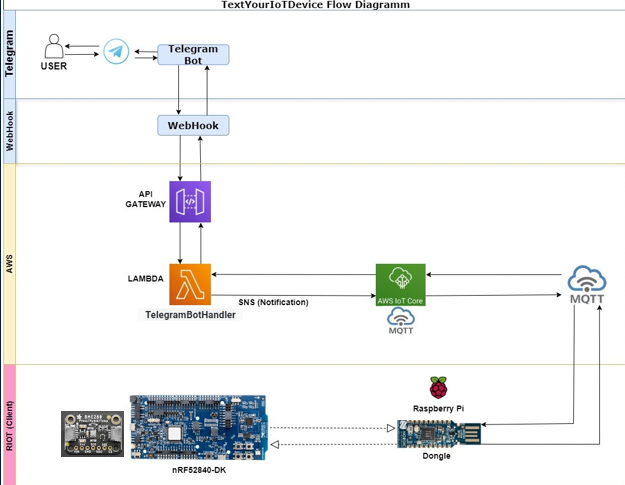

# 🌐 **TextYourIoTDevice**

This project demonstrates how to connect a Nordic nRF52840 Development Kit (DK) to AWS IoT Core via an MQTT broker (Mosquitto) and integrate a Telegram bot for interaction and notifications.
The system uses LEDs for status indication and includes logging and monitoring capabilities through AWS CloudWatch.

---

## 📚 **Table of Contents**
1. [Project Overview](#📜-project-overview)
2. [System Architecture](#📐-system-architecture)
3. [Features](#✨-features)
4. [Requirements](#🛠️-requirements)
5. [Project structure](#📂-project-structure)
6. [Setup Instructions](#🚀-setup-instructions)
    - [1. Flashing the DK](#1-flashing-the-dk)
    - [2. Flashing the Dongle](#2-flashing-the-dongle)
    - [3. Setting up the MQTT Broker](#3-setting-up-the-mqtt-broker)
    - [4. Configuring AWS IoT Core](#4-configuring-aws-iot-core)
    - [5. Telegram Bot Setup](#5-telegram-bot-setup)
    - [6. Linking Everything](#6-linking-everything)
7. [Testing the System](#🔬-testing-the-system)
8. [Troubleshooting](#🛠️-troubleshooting)
9. [Documentation](#📖-documentation)

---

## 📜 **Project Overview** 

This project enables IoT devices to communicate with AWS IoT Core using the MQTT protocol. A Telegram bot is integrated to provide a user interface for sending and receiving messages.  
The primary use case involves a DK that collects sensor data, sends it to an MQTT broker (Mosquitto), which forwards it securely to AWS IoT Core using TLS encryption. The system supports feedback loops via Telegram bot interaction.

---

## 📐 **System Architecture**

### **Components:**
1. **Sensor BME280:**  Temperature, air pressure and humidity sensor
2. **nRF52840 DK:** Publishes sensor data via MQTT.
3. **nRF52840 Dongle:** Functions as a border router for the DK.
4. **Mosquitto (MQTT Broker):** Acts as an intermediary between the DK and AWS IoT Core.
5. **AWS IoT Core:** Central hub for IoT device communication.
6. 
7. 
8.
9. **Telegram Bot:** Allows interaction with the IoT system.
---

## ✨ **Features**

- **End-to-End Encryption:** TLS ensures secure communication between Mosquitto and Telegram bot.
- **Status Indicators:** LEDs on the DK signal connection status and data transfer.
- **Interactive Telegram Bot:** Receive and send messages through a Telegram bot.
- **Logging and Monitoring:** 
Implement logging for debugging and monitoring IoT devices using AWS CloudWatch
---

## 🛠️ **Requirements**

### **Hardware:**
- Nordic nRF52840 DK
- nRF52840 Dongle (used as a border router)
- Raspberry Pi (optional for border router setup)
- Sensor BME280 (If the sensor is not connected, only the value of the internal sensor can be read from the DK)

### **Software:**
- RIOT OS with `paho_mqtt` running on the DK
- RIOT OS with `gnrc_border_router` running on the Dongle
- Mosquitto MQTT Broker installed on an AWS EC2 instance  
- AWS IoT Core configured for MQTT communication
-
-
-
-
- Telegram Bot API  

### **Certificates and Keys:**
- AWS IoT Core Root CA certificate "*AmazonRootCA.pem*"
- Device certificate "*certificate.pem.crt*"
- private key "*private.pem.key*"

### **Tools:**
- FileZilla: SSH client for AWS EC2
- nRF Desktop Connect APP: For flashing the firmware in Dongle
---

## 📂 **Project structure**
The following is an overview of the project's structure:

```plaintext
TextYourIoTDevice/
├── AWS_Conf/               # Contains configuration from AWS such as security certificates project).
├── blinky/                 # temporär ???
├── Board_Datasheet/        # Contains the datasheets of the board and sensors
├── Dongle/                 # Contains the code that is flashed on the dongle as a border router and the IPv6-address of dongle 
│   ├── gnrc_border_router/ # The code of gnrc_border_router of RIOT flashed on the dongle
│   ├── IP_Dongle.txt       # The IPv6-address and the interface name of dongle 
├── images/                 # The images
├── saul/                   # 
│   ├── bin/                #
│   ├── Doxyfiles           # 
│   └── views.py            # 
├── archive.zip/            # 
└── README.md               # 
```
## 🚀 **Setup Instructions**

### **1. Flashing the DK**

1. Clone the project repository:
   ```bash
    git clone https://github.com/Hani-Rezaei/IoT-Chat-Digitalization.git
   ```
2. Into the directory
    ```bash
    cd directory/
    ```
3. Build the application for the nRF52840 DK:
    ```bash
    make BOARD=nrf52840dk TextYourIoTDevice/
    ```
4. Flash the firmware and verify the flashing process by checking the serial output:
    ```bash
    make BOARD=nrf52840dk TextYourIoTDevice/ flash term
    ```
### **2. Flashing the Dongle**

1. Build the application for the Dongle:
    ```bash
    make BOARD=nrf52840dongle dongle/ all
    ```
2. Flash the firmware:
- ????????????????????

### **3. Setting up the MQTT Broker**

1. Contact developers to get the broker up and running

2. Launch an AWS EC2 instance (Ubuntu) and SSH into it:

3. Install Mosquitto:
    ```bash
    sudo apt update
    sudo apt install mosquitto mosquitto-clients
    ```
4. Configure Mosquitto for TLS:
    - Copy the AWS IoT Core certificates to the instance:
        ```bash
        scp -i your-key.pem /path/to/certificate.pem.crt ubuntu@your-ec2-public-ip:/path/to/ec2
        scp -i your-key.pem /path/to/private.pem.key ubuntu@your-ec2-public-ip:/path/to/ec2
        scp -i your-key.pem /path/to/AmazonRootCA1.pem ubuntu@your-ec2-public-ip:/path/to/ec2
        ```
    - Edit the Mosquitto configuration file (/etc/mosquitto/mosquitto.conf):
        ```bash
        listener 8883
        cafile /path/to/AmazonRootCA1.pem
        certfile /path/to/certificate.pem.crt
        keyfile /path/to/private.pem.key
        require_certificate true
        ```
4. Restart Mosquitto:
    ```bash
    sudo systemctl restart mosquitto
    ```
5. run a subscribe mosquitto

### **4. Configuring AWS IoT Core**
1. Register your device in AWS IoT Core and download the
2. device certificate, private key, and root CA. Attach an IoT policy to allow MQTT publish/subscribe actions.
3. Create an IoT Thing and link it with the certificates.

### **5. Telegram Bot Setup**
- Using the Telegram Bot TextYourIoTDevice
```bash
    Username: @TextYourIoTDevicebot
```

### **6. Linking Everything**
1. Ensure the DK is connected to the Mosquitto broker:
    ```bash
    con your-ec2-public-ip 8883 clientID
    ```
2. Use a test client to publish and subscribe to MQTT topics:
    ```bash
    mosquitto_pub -h your-ec2-public-ip -t "test/topic" -m "Hello World"
    mosquitto_sub -h your-ec2-public-ip -t "test/topic"
    ```
3. Verify the connection between Mosquitto and AWS IoT Core by publishing a message from the DK and observing it in the AWS IoT Core MQTT Test Client.

## 🔬 **Testing the System**
1. Power on the DK and verify the LEDs indicate the connection status.
2. Send a message via the Telegram bot and observe it being processed by AWS IoT Core.
3. Monitor logs in AWS CloudWatch for debugging and performance insights.
## 🛠️ **Troubleshooting**
1. Issue: DK cannot connect to Mosquitto.
+ **Solution:** Verify the broker IP and TLS certificates.
---
2. Issue: Messages are not visible in AWS IoT Core.
- **Solution:** Check the Mosquitto configuration and AWS IoT policies.
---

## 📖 **Documentation**
**1. Inline Code Documentation and code structur:** 

- Doxygen is used for code-level documentation.
    1. Doxygen
        ```bash
            sudo apt install doxygen
        ```
    2. Doxygen-Konfigurationsdatei generieren:
        ```bash
            doxygen -g
        ```
    3. Die generierte Doxyfile anpassen:
        ```plaintext
        ~/Doxyfile/
        ```
    4. Doxygen ausführen:
        ```bash
        doxygen Doxyfile
        ```
    5. Die generierte Dokumentation wird im angegebenen *OUTPUT_DIRECTORY* gespeichert.
    
    6. Im einem Browser, um die Dokumentation anzusehen:
        ```bash
        xdg-open doc/html/index.html  # Auf Linux
        open doc/html/index.html      # Auf macOS
        ```
- If required, there is inline code in each file

**2. README.md:** This documentation (detailed steps for setup and usage).

**3. Final Documentation:** Comprehensive project report.
