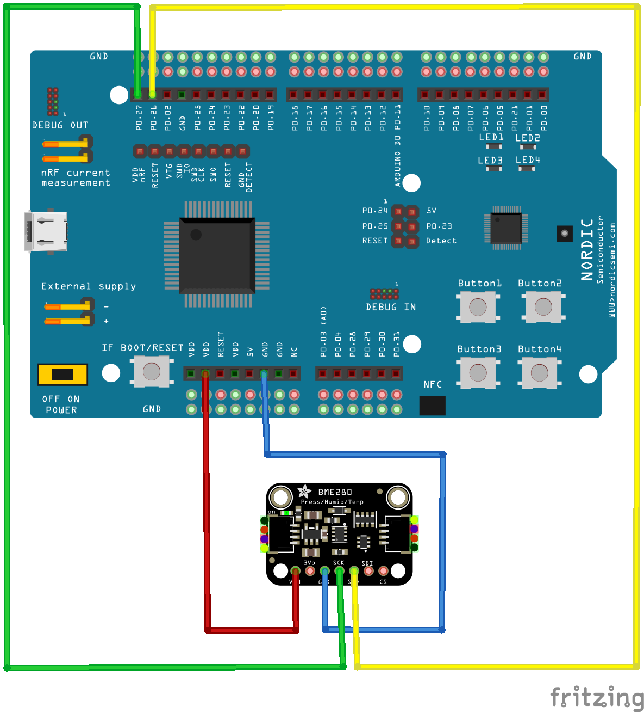

# 🌐 **TextYourIoTDevice**

This project demonstrates how to connect a Nordic nRF52840 Development Kit (DK) to AWS IoT Core via an MQTT broker (Mosquitto) and integrate a Telegram bot for interaction and notifications.
The system uses LEDs for status indication and includes logging and monitoring capabilities through AWS CloudWatch.

---

## 📚 **Table of Contents**
1. [Project Overview](#-project-overview)
2. [System Architecture](#-system-architecture)
3. [Features](#-features)
4. [Requirements](#-requirements)
5. [Project structure](#-project-structure)
6. [Setup Instructions](#-setup-instructions)
    - [1. Flashing the DK](#1-flashing-the-dk)
    - [2. Flashing the Dongle](#2-flashing-the-dongle)
    - [3. The MQTT Broker on AWS EC2](#3-the-mqtt-broker-on-aws-ec2)
    - [4. The MQTT Broker on AWS IoT Core](#4-the-mqtt-broker-on-aws-iot-core)
    - [5. The AWS Lambda TelegramBotHandler](#5-the-aws-lambda-telegrambothandler)
    - [6. The AWS API Gateaway](#6-the-aws-api-gateaway)
    - [7. The Webhook](#7-the-webhook)
    - [8. Telegram Bot](#5-telegram-bot)
7. [Testing the System](#-testing-the-system)
8. [Troubleshooting](#️-troubleshooting)
9. [Documentation](#-documentation)
10. [Contact](#-contact)

---

## 📜 **Project Overview** 

This project enables IoT devices to communicate with AWS IoT Core using the MQTT protocol. A Telegram bot is integrated to provide a user interface for sending and receiving messages.  
The primary use case involves a DK that collects sensor data, sends it to an MQTT broker (Mosquitto), which forwards it securely to AWS IoT Core using TLS encryption. The system supports feedback loops via Telegram bot interaction.

---

## 📐 **System Architecture**

### **Components:**
1. **Sensor BME280:**  Temperature, air pressure and humidity sensor
2. **nRF52840 DK:** Publishes sensor data via MQTT.
3. **nRF52840 Dongle:** Functions as a border router for the DK.
4. **Mosquitto (MQTT Broker):** Acts as an intermediary between the DK and AWS IoT Core.
5. **AWS IoT Core:** Central hub for IoT device communication.
6. **AWS Lamda:** 
7. **AWS API Gateaway:** 
8. **Webhook:** 
9. **Telegram Bot:** Allows interaction with the IoT system.
---

## ✨ **Features**

- **End-to-End Encryption:** TLS ensures secure communication between Mosquitto and Telegram bot.
- **Status Indicators:** LEDs on the DK signal connection status and data transfer.
- **Interactive Telegram Bot:** Receive and send messages through a Telegram bot.
- **Logging and Monitoring:** 
Implement logging for debugging and monitoring IoT devices using AWS CloudWatch
---

## 🛠️ **Requirements**

### **Hardware:**
- Nordic nRF52840 DK
- nRF52840 Dongle (used as a border router)
- Raspberry Pi (optional for border router setup)
- Sensor BME280 (If the sensor is not connected, only the value of the internal sensor can be read from the DK)

### **Software:**
- RIOT OS with `paho_mqtt` running on the DK
- RIOT OS with `gnrc_border_router` running on the Dongle
- Mosquitto MQTT Broker installed on an AWS EC2 instance  
- AWS IoT Core configured for MQTT communication
-
-
-
-
- Telegram Bot API  

### **Certificates and Keys:**
- AWS IoT Core Root CA certificate "*AmazonRootCA.pem*"
- Device certificate "*certificate.pem.crt*"
- private key "*private.pem.key*"

### **Tools:**  
- [FileZilla](https://filezilla-project.org/download.php): SSH client for AWS EC2
- [nRF Connect for Desktop](https://www.nordicsemi.com/Products/Development-tools/nRF-Connect-for-Desktop/Download#infotabs) : For flashing the firmware in Dongle
---

## 📂 **Project structure**
The following is an overview of the project's structure:

```plaintext
TextYourIoTDevice/
├── aws/                        # Contains configuration from AWS such as security certificates project.
│   ├── AWS_EC2_Conf/           # Configurations of AWS EC2
│   ├── AWS_IoTCore_TLS_Conf/   # Configurations of AWS IoT Core and TLS certificates
│   ├── Lambda/                 # Lambda functions 
├── Board_Datasheet/            # Contains the datasheets of the board and sensors
├── Dongle/                     # Contains the code that is flashed on the dongle as a border router and the IPv6-address of dongle 
│   ├── gnrc_border_router/     # The code of gnrc_border_router of RIOT flashed on the dongle
│   ├── ip_address_dongle.md    # The IPv6-address and the interface name of dongle 
├── Doxyfiles/                  # The Doxyfile and configurations
├── images/                     # The images
├── TextYourIoTDevice/          # The code of TextYourIoTDevice flashed on the DK
│   ├── led_utils.h             # Header file of led_utils
│   ├── led_utils.c             # C file of led_utils
│   ├── main.c                  # Main file
│   ├── Makefile                # Main makefile
│   ├── Makefile.board.dep      # Makefile of board.dep of RIOT
│   ├── Makefile.ci             # Makefile of ci of RIOT
│   ├── Makefile.gnrc           # Makefile of gnrc of RIOT
│   ├── Makefile.Iwip           # Makefile of Iwip of RIOT
│   ├── Makefile.mqtt           # Makefile of mqtt of RIOT
│   ├── Makefile.saul           # Makefile of saul of RIOT
│   ├── mqtt_utils.h            # Header file of mqtt_utils
│   ├── saul_utils.h            # Header file of saul_utils
│   ├── saul_utils.c            # C file of saul_utils
│   ├── shell_command_utils.c   # C file of shell_command_utils
└── README.md                   # This documentation
```
## 🚀 **Setup Instructions**

### **1. Flashing the DK**

1. Hardware Connections
    
    1. Connect the sensor BME280 to DK as shown in the following photo:

    

    **BME280 Pinout (for I2C)**:

        VCC (BME280) → 3.3V (nRF52840DK)
        GND (BME280) → GND (nRF52840DK)
        SDA (BME280) → SDA (Pin 26 on nRF52840DK)
        SCL (BME280) → SCL (Pin 27 on nRF52840DK)
        SDO (BME280) → GND (for I2C address 0x76) or 3.3V (for I2C address 0x77)


**Important NOTE**: The program is already flashed on the DK. If you still want to make it, go through the following steps.

2. Clone the project repository:
   ```bash
    git clone https://github.com/Hani-Rezaei/IoT-Chat-Digitalization.git
   ```
3. Into the directory
    ```bash
    cd directory/
    ```
4. Build the application for the nRF52840 DK:
    ```bash
    make BOARD=nrf52840dk TextYourIoTDevice/
    ```
5. Flash the firmware and verify the flashing process by checking the serial output:
    ```bash
    make BOARD=nrf52840dk TextYourIoTDevice/ flash term
    ```
### **2. Flashing the Dongle**

1. Build the application for the Dongle:
    ```bash
    make BOARD=nrf52840dongle dongle/ all
    ```
2. Copy created build *.hex*  

3. Start the tool
[nRF Connect for Desktop](https://www.nordicsemi.com/Products/Development-tools/nRF-Connect-for-Desktop/Download#infotabs)

4. Flash the firmware in dongle (see documentation for detailed instructions)

### **3. The MQTT Broker on AWS EC2**

The mqtt broker on AWS EC2 should work fine.

If it doesn't, contact developer or look at the documentation. to know how the broker was created and configured.

### **4. The MQTT Broker on AWS IoT Core**
The mqtt broker on AWS IoT Core should work fine.

If it doesn't, contact developers or look at the documentation. to know how the broker was created and configured.

### **5. The AWS Lambda *TelegramBotHandler***
The AWS Lambda function *TelegramBotHandler* should work fine.

If not, contact the developers or read the documentation to learn how the function was created and configured.

### **6. The AWS API Gateaway**
The AWS API Gateaway should work fine.

If not, contact the developers or read the documentation to learn how the function was created and configured.

### **7. The Webhook**
The Webhook should work fine.

If not, contact the developers or read the documentation to learn how the function was created and configured.

### **8. Telegram Bot**
Using the Telegram Bot **TextYourIoTDevice**
```bash
    Username: @TextYourIoTDevicebot
```

## 📖 **Documentation**
**1. Inline Code Documentation and code structur:** 

- **Doxygen** is used for code-level documentation.
    1. Doxygen
        ```bash
            sudo apt install doxygen # Auf Linux  
        ```
    2. Doxygen-Konfigurationsdatei generieren:
        ```bash
            doxygen -g
        ```
    3. Die generierte Doxyfile anpassen:
        ```plaintext
        ~/Doxyfiles/Doxyfile
        ```
    4. Doxygen ausführen:
        ```bash
        doxygen Doxyfile
        ```
    5. Die generierte Dokumentation wird im angegebenen *OUTPUT_DIRECTORY* gespeichert.
    
    6. Im einem Browser, um die Dokumentation anzusehen:
        ```bash
        xdg-open doc/html/index.html  # Auf Linux
        ```
- If required, there is **inline code** in each file.

**2. README.md:** This documentation (detailed steps for setup and usage).

**3. Final Documentation:** Comprehensive project report.

## 👨‍💻 **Contact**

1. Mohammadjavad Esmaeili 

    📧 Email: [mohammadjavad.esmaeili@stud.fra-uas.de](mohammadjavad.esmaeili@stud.fra-uas.de)
       
1. Hani Rezaei 

    📧 Email: [hani.rezaei@stud.fra-uas.de](hani.rezaei@stud.fra-uas.de)

